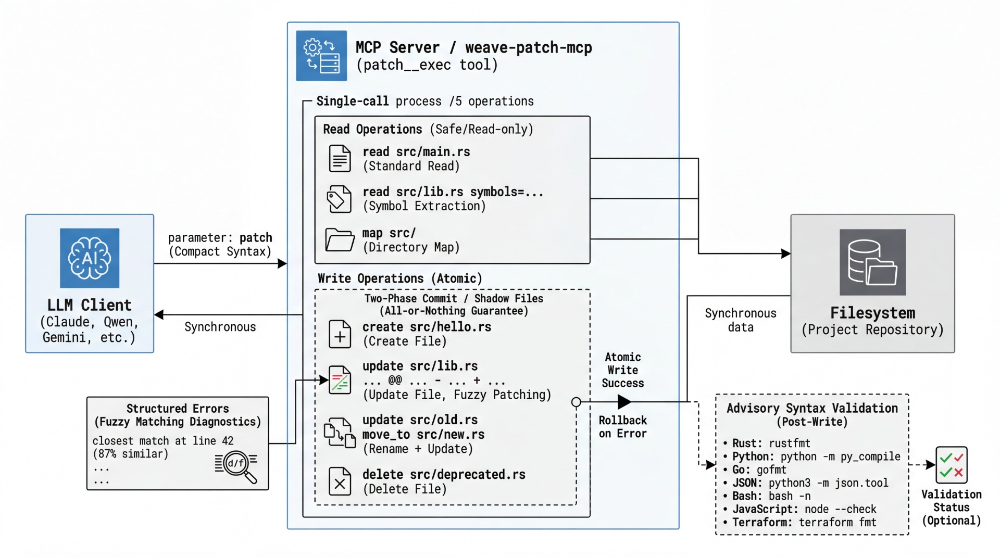

# weave-patch-mcp

[](https://www.npmjs.com/package/mcp-weave-patch) [](https://opensource.org/licenses/MIT) [](#supported-platforms)

**One tool. Five operations. Zero intermediate states.**



Code drifted? We still find it. Refactor touched 47 files? All-or-nothing writes. No half-applied states left behind.

---

## The Problem

Context drift makes line numbers stale. Token limits force LLM agents into partial commits. Half-finished refactors scatter across repos when agents can't apply atomic changes.

**Blind spots surface before the agent ships.**

Every multi-file edit is a gamble. One call fails, and now the agent is debugging intermediate state. Meanwhile, the context window shrinks.

## Why This Over Edit/Write?

| | Traditional (Edit + Write) | weave-patch-mcp |
|---|---|---|
| **Calls per change** | 1 tool call per file | 1 call for all files |
| **Multi-file atomicity** | No — broken intermediate states | Yes — all-or-nothing |
| **Context anchoring** | Line numbers (drift after edits) | Pattern matching (survives drift) |
| **Token cost** | High — full file content per call | Low — only diffs sent |
| **Reviewer clarity** | Opaque (full file dumps) | Standard diff format |
| **Scale** | Painful at 5+ files | Handles 100+ files per call |
| **Error recovery** | Manual retry | Fuzzy matching + structured diagnostics |

**Atomic patches that survive context drift.** Scale from 1 file to 100+. Same call. Same guarantees.

### Recommended: Disable Traditional Tools

For best results, deny Edit/Write in MCP client settings so the LLM agent always uses weave-patch:

Add to the client's deny list:
```json
["Edit(*)", "Write(*)"]
```

**Stop burning tokens on unused tool descriptions.**

## Installation

```bash
npx -y mcp-weave-patch
```

No install required. npx fetches the latest release, caches it at `~/.weave-patch/bin/`, and auto-reinstalls on version changes.

### Supported Platforms

| OS | Architecture |
|---|---|
| macOS | arm64, x64 |
| Linux | x64, arm64 |
| Windows | x64 |

## MCP Configuration

### Claude Code

```bash
claude mcp add -s user weave -- npx -y mcp-weave-patch
```

### Qwen Code

Add to `~/.qwen/settings.json` under `mcpServers`:
```json
"weave": {
  "command": "npx",
  "args": ["-y", "mcp-weave-patch"]
}
```

### Gemini CLI

Add to `~/.gemini/settings.json`:
```json
{
  "mcpServers": {
    "weave": {
      "command": "npx",
      "args": ["-y", "mcp-weave-patch"]
    }
  }
}
```

### OpenCode

Add to the config:
```json
{
  "mcpServers": {
    "weave": {
      "command": "npx",
      "args": ["-y", "mcp-weave-patch"]
    }
  }
}
```

## Tool: `patch__exec`

One tool, one parameter (`patch`). Five operations available in a single atomic call.

All patches are wrapped in `=== begin` / `=== end` markers.

### 1. Read a file

**Extract just what's needed.** Symbol extraction pulls functions, classes, and structs without reading entire files — token-efficient and surfacing relevant context.

```
=== begin
read src/main.rs
=== end
```

**Read with symbol extraction** (Rust, Python, TypeScript, JS, Go):
```
=== begin
read src/lib.rs symbols=Server,handle_request language=rust
=== end
```

**Read with line range**:
```
=== begin
read config.py offset=10 limit=50
=== end
```

**Read multiple files** (batch read):
```
=== begin
read src/main.rs
read src/lib.rs
read src/config.rs
=== end
```

### 2. Map a directory

**Know the repo's shape at a glance.** Returns files, sizes, line counts, and function signatures — everything needed to navigate unfamiliar code.

```
=== begin
map src/ depth=2
=== end
```

Defaults: `depth=3`, `limit=6000` chars.

### 3. Add a file

**Every file starts with one call.** No switching tools, no context pollution.

```
=== begin
create src/hello.rs
+pub fn hello() { println!("Hello!"); }
=== end
```

### 4. Update a file

**Code drifted? We still find it.** Three-phase matching (exact → whitespace-normalized → fuzzy at 85%+) means context drift won't break the patch.

**Not "match failed" — "closest match at line 42 (87% similar)."**

Structured diagnostics show the top-3 closest matches with line numbers and similarity scores. Self-correct without re-reading the entire file.

Context lines (space-prefixed) anchor the edit. `-` removes, `+` adds.

```
=== begin
update src/lib.rs
@@ impl Server
 pub fn handle(&self, req: Request) -> Response {
-    self.old_handler(req)
+    self.new_handler(req)
 }
=== end
```

**Multiple hunks in one file**:
```
=== begin
update src/lib.rs
@@ fn setup
 fn setup() {
-    old_init();
+    new_init();
 }
@@ fn teardown
 fn teardown() {
-    old_cleanup();
+    new_cleanup();
 }
=== end
```

**Rename a file** (update + move):
```
=== begin
update src/old.rs
move_to src/new.rs
@@ fn foo
 fn foo() { ... }
=== end
```

**Update multiple files** (batch update):
```
=== begin
update src/api.rs
@@ fn handle
 fn handle() {
-    old();
+    new();
 }
update src/db.rs
@@ fn connect
 fn connect() {
-    let url = "old";
+    let url = "new";
 }
=== end
```

### 5. Delete a file

**Clean removal.** One call, file gone. No orphaned references left behind.

```
=== begin
delete src/deprecated.rs
=== end
```

**Delete multiple files** (batch delete):
```
=== begin
delete src/deprecated1.rs
delete src/deprecated2.rs
delete src/deprecated3.rs
=== end
```

### Combined: all operations in one call

```
=== begin
read src/main.rs
map src/ depth=1
update src/lib.rs
@@ fn main
 fn main() {
-    old();
+    new();
 }
create src/greet.rs
+pub fn greet() { println!("hi"); }
delete src/deprecated.rs
=== end
```

Read operations execute first (safe/read-only), then write operations are applied atomically.

## Key Concepts

- **Atomicity** — All-or-nothing writes. No half-applied refactors. Multi-file patches use two-phase commit with shadow files. If any operation fails, everything rolls back.

- **Fuzzy matching** — Code drifted? We still find it. Three-phase pipeline matches context even after edits.

- **Structured errors** — LLM-friendly diagnostics that show exactly where and why matching failed.

- **Advisory validation** — Syntax checks after every write, without blocking the patch.

  **Supported validators:**

  | Language   | Tool                         |
  |------------|------------------------------|
  | Rust       | `rustfmt`                    |
  | Python     | `python -m py_compile`       |
  | Go         | `gofmt`                      |
  | JSON       | `python3 -m json.tool`       |
  | Bash       | `bash -n`                    |
  | JavaScript | `node --check`               |
  | Terraform  | `terraform fmt`              |

- **Limits**: 2MB total output for reads, 512KB per file.
- **Security**: Symlinks rejected. Path traversal allowed (tool can access any path with user permissions).

## Use-Case Matrix

| Scenario | Operations | Why It Wins |
|----------|-----------|-------------|
| **Multi-file refactor** | `update` (batch) | One call, 47 files. All-or-nothing. |
| **Exploring unfamiliar code** | `map` + `read symbols=` | Token-efficient symbol extraction |
| **Fixing tests across files** | `read` + `update` + `delete` | Combined read/write in one atomic call |
| **Deleting deprecated paths** | `delete` (batch) | Clean removal, no partial states |
| **Renaming during refactor** | `update` + `move_to` | Rename and edit atomically |
| **Adding new modules** | `create` (batch) | Create multiple files without tool-switching |

## Architecture

**One tool. One parameter. Everything else is handled.**

```
┌──────────────┐     ┌──────────────┐     ┌──────────────┐
│  LLM Client  │────▶│  MCP Server  │────▶│  Filesystem  │
│  (Claude,    │     │ patch__exec  │     │ (reads,      │
│  Qwen, etc.) │◀────│              │◀────│ writes)      │
└──────────────┘     └──────────────┘     └──────────────┘
```

**CI/CD Pipeline** (triggered on push to `main`):

**150 tests. Comprehensive test coverage. If it fails, nothing ships.**

```
test (fmt + clippy + 150 tests)
  ↓
version-bump (auto-increment patch)
  ↓
build (5 platforms: macOS arm64/x64, Linux x64/arm64, Windows x64)
  ↓
release (GitHub Releases with binaries + SHA256)
  ↓
publish (npm registry)
```

If tests fail, nothing is released.

## Development

Build from source:

```bash
cargo build --release
```

Binary: `target/release/weave-patch-mcp`

Run tests:

```bash
cargo test
```

### Test Coverage (150 tests)

| Suite | Coverage |
|---|---|
| `tests/integration_test.rs` | Core patch operations, edge cases (Unicode, empty files, long lines, concurrent shadow collision, multi-op atomicity, CRLF) |
| `tests/server_test.rs` | MCP server, `patch__exec` (globs, line ranges, symbol extraction, patch operations, error handling) |
| `tests/validator_test.rs` | All 7 language-specific advisory validators |
| `src/parser.rs` (unit) | Compact syntax patch parsing, auto-wrap missing markers, multi-file, hints, Read/Map specs |
| `src/applier.rs` (unit) | Path validation, fuzzy matching, validators, diff generation, match info |
| `src/reader.rs` (unit) | Line ranges, symbol extraction (Rust/Python/TS/Go), glob expansion |

## License

MIT
